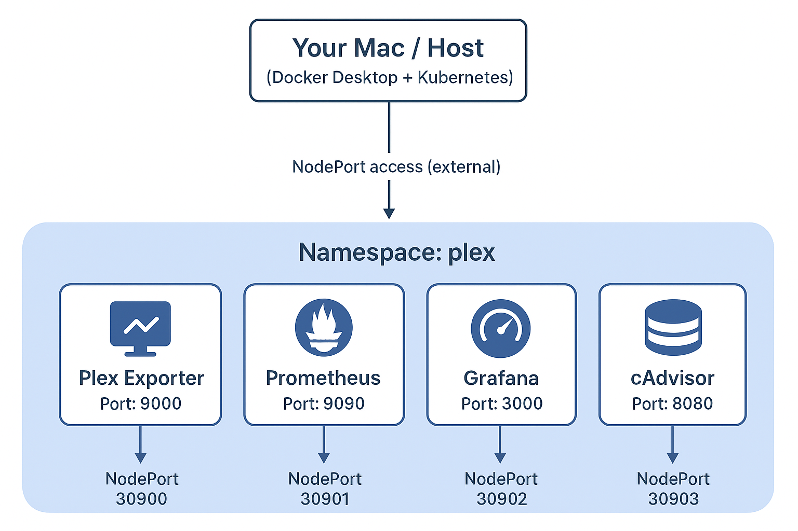
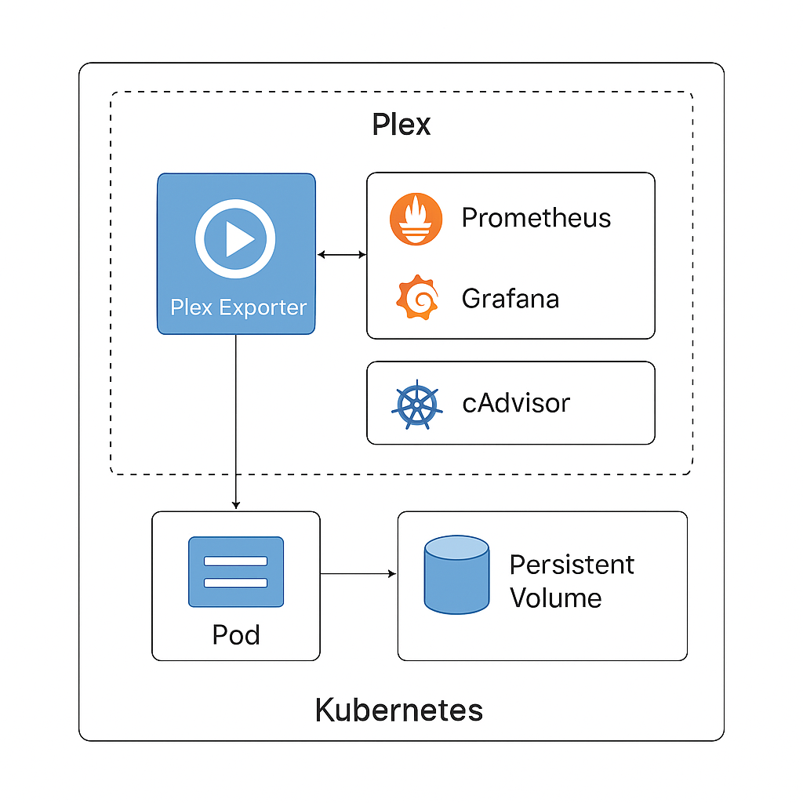
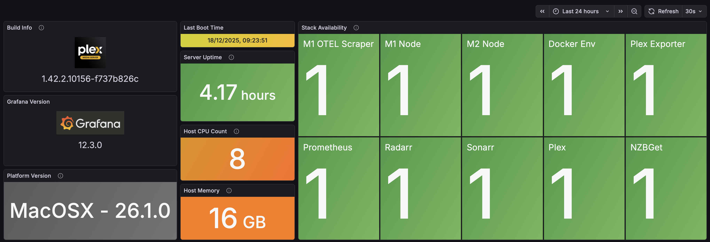
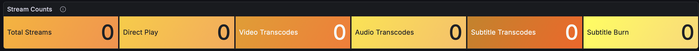
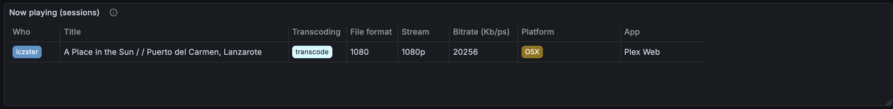

# Plex Monitoring Stack on Kubernetes

This repository contains a Kubernetes deployment for monitoring a Plex server using **Prometheus**, **Grafana**, **cAdvisor**, and a **Plex exporter**. This setup is safe for testing alongside existing Docker Compose stacks by using **unique persistent volume paths**.

## Overview

This stack consists of:

- **Plex Exporter** – exposes Plex metrics for Prometheus.  
- **Prometheus** – scrapes metrics from the Plex exporter.  
- **Grafana** – visualizes metrics stored in Prometheus.  
- **cAdvisor** – monitors Docker host metrics.  

All services are exposed via **LoadBalancer** for access from other devices on your local network.

---

## 📦 Components Services and Ports

| Service                    | NodePort | Description                          | Access URL Example                   |
|----------------------------|----------|--------------------------------------|--------------------------------------|
| Plex Exporter              | 30900    | Metrics endpoint for Prometheus      | `http://<host-ip>:30900/metrics`     |
| Prometheus                 | 30901    | Metrics server                       | `http://<host-ip>:30901`             |
| Grafana                    | 30902    | Dashboard UI & Visualisation         | `http://<host-ip>:30902`             |
| cAdvisor                   | 30903    | Docker host monitoring               | `http://<host-ip>:30903`             |

> Replace `<host-ip>` with your Mac’s local network IP, e.g., `192.168.1.100`.  


This project deploys a monitoring stack for Plex using **Prometheus**, **Grafana**, **cAdvisor**, and a **Plex Exporter** running inside Kubernetes.  

It is designed so you can safely test Kubernetes **without interfering** with any existing Docker Compose deployments to ensure isolation

All resources run in the namespace: **`plex`**

---


## 🌐 Reference Architecture




---

## Prerequisites

- **Docker Desktop with Kubernetes enabled** (single-node cluster)  
- `kubectl` CLI configured to use Docker Desktop cluster  
- Basic knowledge of `kubectl` commands  
- Optional: knowledge of changing NodePort numbers or PV paths  

---

## Directory Setup

None required Docker Desktop local hostpaths are used and appropriate controls applied for prometheus data


| Namespace: plex              |
| ---------------------------- |
| Plex Exporter  :30900        |
| Prometheus     :30901        |
| Grafana        :30902        |
| cAdvisor       :30903        |
| +--------------------------+ |


---

## 📂 Persistent Storage Paths

These must be **unique** and must not overlap your existing Docker Compose monitoring stack.

| Service     | Default Test Path (Change if desired)  |
|-------------|----------------------------------------|
| Prometheus  | `local docker storage path`            |
| Grafana     | `Not required configmaps used`         |


---

## 1. ✅ Prerequisites

- Docker Desktop with **Kubernetes enabled**
- `kubectl` installed and configured
- LAN network access (to view dashboards on other devices)
- You have updated the YAML configuration files to include the following
    - Your own IP/Address ports for Sonar / Radarr & Plex
    - Your own Plex token
    - Allowed Hosts have been updated 
    - Your own API keys have been updated
    - Location for the cron scripts have been updated for your own enviroment

---

## 2.  🚀 Deployment Steps

### Create namespace

```bash
kubectl apply -f namespace.yaml 
```
## 2. Grafana Dashboard Provisioning Step (IMPORTANT)

> Create configmaps to provision dashboards BEFORE Grafana starts:

```bash
pre-provisioning-grafana.sh
```

### 3. Deployment Steps


```bash
kubectl apply -f prometheus.yaml
```
```bash
kubectl apply -f grafana.yaml
```
```bash
kubectl apply -f cadvisor.yaml
```
```bash
kubectl apply -f plex-exporter.yaml
```
```bash
kubectl apply -f kube-state-metrics.yaml
```
> Check the status of the pod & logs after each deployment
---


### 4. Confirm pods are running:
```bash
kubectl get pods -n plex
```

Run the stack checks script
```bash
stack-checks.sh
```

Expected:

```sql
plex-exporter-xxxxx   Running
prometheus-xxxxx      Running
grafana-xxxxx         Running
cadvisor-xxxxx        Running
```

### 5. Confirm services are active:

```bash
kubectl get svc -n plex
```

## 6. 🔍 Testing Access

| Service       | Test URL Example                 | What to Check                           |
| ------------- | -------------------------------- | --------------------------------------- |
| Prometheus    | `http://<host-ip>:30901/targets` | `plex-exporter` → **UP**                |
| Grafana       | `http://<host-ip>:30902`         | Login and confirm Prometheus datasource |
| cAdvisor      | `http://<host-ip>:30903`         | Metrics stream visible                  |
| Plex Exporter | `http://<host-ip>:30900/metrics` | Scrapeable output                       |

## 7. 🛑 Remove Stack (Safe rollback)

```bash
kubectl delete namespace plex
```

```NOTE:``` This removes the namespace and all pods. Also check prometheus-pv is also deleted if not 

```bash
kubectl delete pv prometheus-pv -n plex
```

## 8. 🎯 Summary

- Safe to test without affecting existing setups (isolated configs and deployment)
- A great introduction to kubernetes and a practical use case
- Fully network accessible across your LAN
- Fully working Kubernetes monitoring stack for your Plex server
- Grafana dashboards auto provisioned via ConfigMaps  
- Prometheus scraping internal and external targets  
- Sonarr and Radarr integrations working  
- Docker Desktop networking quirks handled  


## 9. 🎯 Some Dashboard Previews
### Plex Overview

### Stream Count

### Playing Sessions

